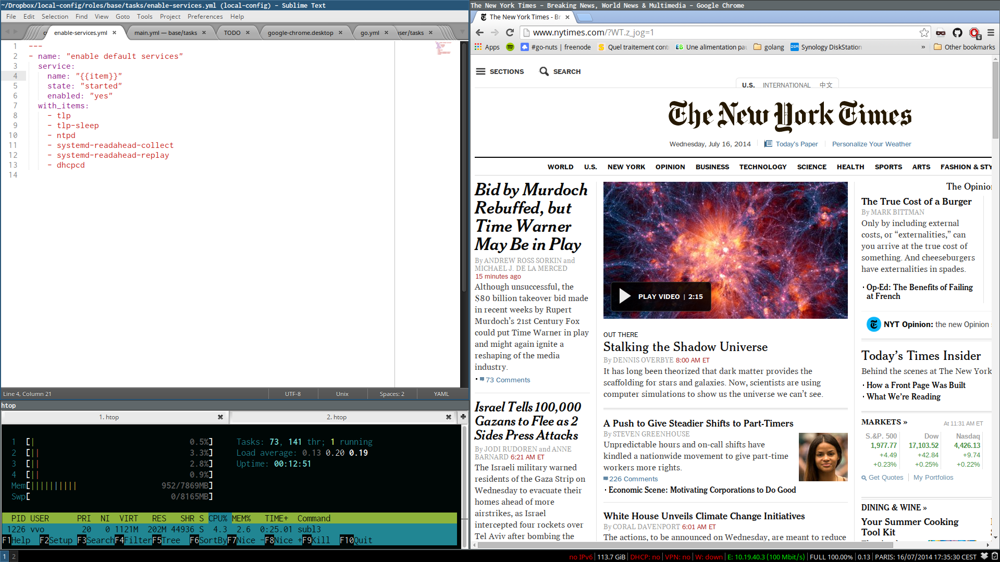

# ansible-archee

My full developer environment as an ansible playbook.

Used to configure [archlinux](https://www.archlinux.org/) on a [thinkpad X240](http://shop.lenovo.com/us/en/laptops/thinkpad/x-series/x240/).

Some tasks are platform/model independent but some are specific to the thinkpad X240.

Read and use what is revelant to you.

## Preview

Here's how my setup look like.

## Main features

- i3
- audio
- video
- usb keyboard and laptop keyboard, [us altgr-intl](http://dry.sailingissues.com/keyboard-US-International2.png) layout
- power management with [hybrid hibernate](https://wiki.archlinux.org/index.php/Systemd#Power_management) working
- every font and font customization needed to get very good looking fonts

## Encrypted variables

Some variables are encrypted so you must [provide them](http://docs.ansible.com/playbooks_variables.html) if you really want to reuse this whole repository.

- `user_name`
- `user_ssh_private_key`
- `spotify_autologin`
- `spotify_lastfm_pass` 
